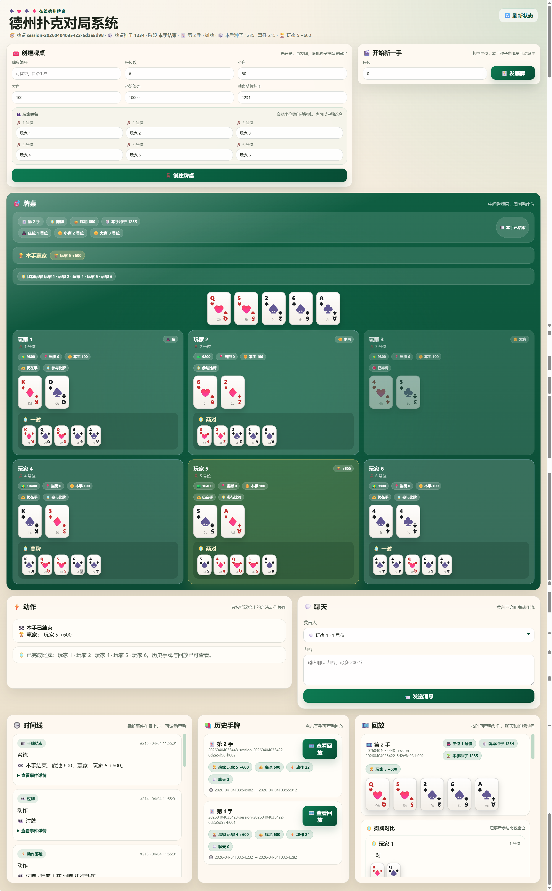

# Poker Table

基于 `FastAPI + pokerkit + SQLite` 的网页德州扑克对局系统。



## 当前能力

- Session 级随机种子，hand seed 自动按手数递增派生
- SQLite 持久化 session、seat、hand、event、replay 与幂等请求
- 运行中 hand 支持按持久化事件自动恢复
- 内置网页支持两种模式：
  - `用户参与`：网页固定代表 1 个用户位，只显示自己的底牌，不显示当前手时间线
  - `旁观模式`：隐藏动作区与聊天区，显示当前手时间线
- 历史手牌列表与单手 replay

后端 API 仍然是通用接口；内置网页上的人数上限、名称生成和界面锁定，属于前端约束，不是后端强校验。

## 启动

```powershell
python -m uvicorn app.main:app --reload
```

默认会在项目根目录创建/使用 `poker_table.db`，并以 UTF-8 读取 `poker_table_sqlite_schema.sql` 初始化数据库。

## 可选启动配置

可以在启动前通过环境变量配置 5 个随机角色名称。必须正好提供 5 个、唯一、逗号分隔的 UTF-8 名称；如果配置不合法，应用会在启动时直接报错。

```powershell
$env:POKER_BOT_NAMES="阿岚,老岩,唐梨,温策,小顾"
python -m uvicorn app.main:app --reload
```

默认名称池为：

- `阿岚`
- `老岩`
- `唐梨`
- `温策`
- `小顾`

## 内置网页行为

- 创建或载入 session 后，session 设置区会隐藏，只保留“开始新一手”
- `用户参与` 模式下：
  - 用户默认名称为 `玩家`
  - 创建前可改名，创建后和重新载入后不可修改
  - 其他玩家未公开的手牌会显示为牌背
- `旁观模式` 下：
  - 动作区与聊天区隐藏
  - 当前手时间线可见

## 测试

```powershell
pytest
```

## 目录

- `app/`: 后端应用、规则内核、前端模板与静态资源
- `docs/`: 架构、接口说明与验收文档
- `tests/`: 自动化测试
- `poker_table_openapi.yaml`: 接口契约
- `poker_table_sqlite_schema.sql`: SQLite 表结构
